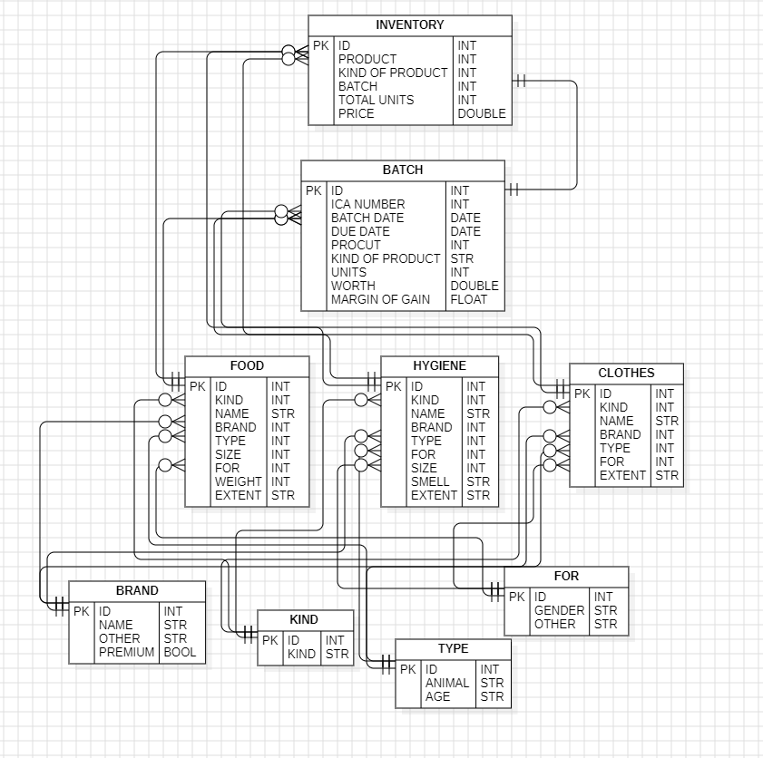
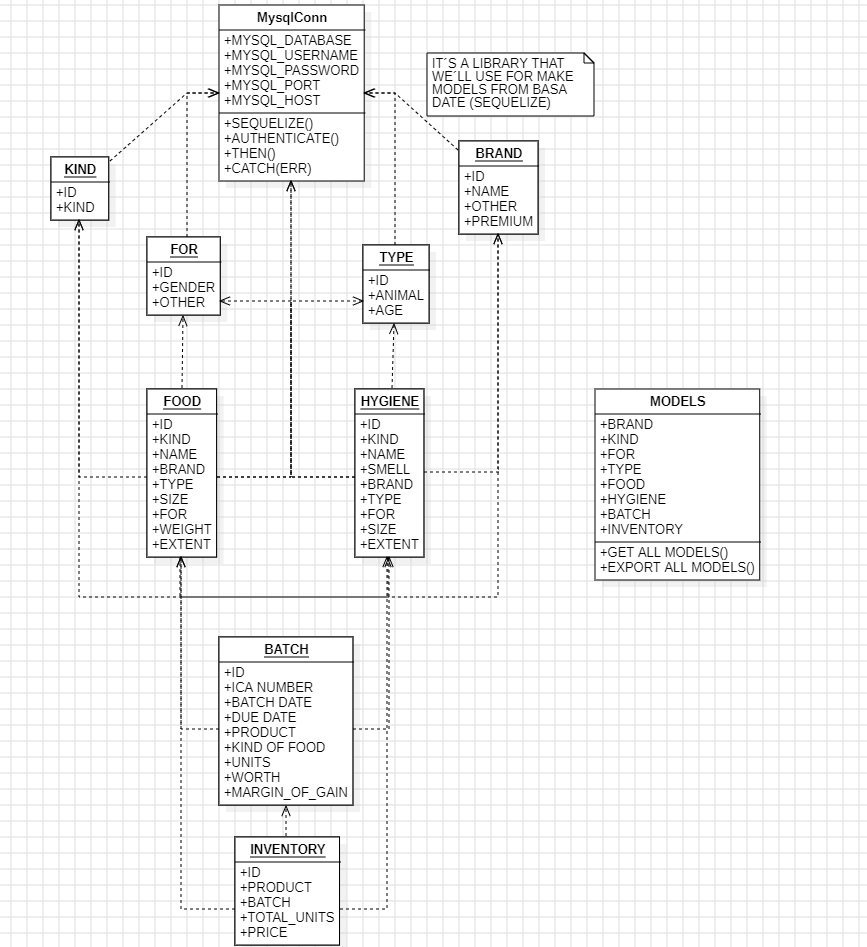

# Empresa 

Tener en cuenta que esta App se va Aplicar por medio de la Metodologia RUP

Esta empresa se basa a la **Venta de Comida de Animales Domésticos** donde el representante es

*Kellin Alejandra Guerrero Leiva*
*cc: 1000786103*

Ubicado en

*Soacha - Cll 46 # 11-11* en el Barrio *León XIII*

Donde se contacta con ella por medio de *WhatsApp* para llegar a la conclusión de la necesidades que ella exige para la creación del Proyecto

Se presentan las siguientes Necesidades

	Visualización de la información que ella Maneja para una facil Interpretación
	
	Necesita un generador de Reporter de las Actividades y de los Productos que ella administra 
	
	Necesita la Integración de Imagenes en el Software para una Mejor Interpretación del Sistema

## Misión

	Animals go brinda a nuestros clientes y sus mascotas un lugar donde puedan encontrar
	productos de alta calidad y un ambiente amigable que promueva el bienestar animal

## Visión

	Convertirnos en el referente principal en la comunidad para los amantes de las mascotas,
	siendo reconocidos por nuestra excelencia en productos, servicios y compromiso con el
	cuidado y la felicidad de los animales

## Objetivos

	1.	Ofrecer una amplia variedad de productos de alta calidad para mascotas, incluyendo 
	alimentos Premium, golosinas, accesorios y productos para el cuidado.
	
	2.	 Proporcionar un servicio al cliente excepcional, brindando asesoramiento sobre la 
	alimentación, el cuidado y el bienestar de las mascotas.
	
	3.	Implementar un sistema de gestión de precios que permita monitorear y ajustar 
	dinámicamente los precios de los productos, asegurando competitividad en el mercado 
	y maximizando la rentabilidad.
	
	4.	Utilizar el software para analizar datos de ventas y tendencias del mercado, 
	lo que permitirá tomar decisiones informadas sobre la fijación de precios, 
	la gestión de inventario y la introducción de promociones estratégicas.
	
	5.	Utilizar el software para establecer estrategias de precios dinámicas que se 
	adapten a las demandas estacionales y las tendencias del mercado, garantizando 
	una óptima rotación de inventario y una oferta atractiva para los clientes.

## Principios

	1.	Compromiso con la calidad: Garantizar la selección de productos de la más 
	alta calidad para promover la salud y el bienestar de las mascotas.
	2.	Responsabilidad ambiental: Promover prácticas sostenibles en todas las 
	operaciones, desde la selección de proveedores hasta la gestión de residuos.
	3.	Transparencia y honestidad: Mantener una comunicación clara con los clientes, 
	proporcionando información detallada sobre los productos, sus beneficios y su origen.
	4.	Eficiencia: Desarrollar un software que optimice la gestión de precios, permitiendo 
	una actualización ágil y precisa de los costos de los productos.
	5.	Flexibilidad: Diseñar un sistema que pueda adaptarse a las necesidades cambiantes 
	del mercado y las estrategias comerciales, ofreciendo opciones personalizadas para la 
	fijación de precios.
	6.	Integridad de datos: Garantizar la precisión y confiabilidad de la información 
	relacionada con los precios y el inventario, para respaldar decisiones informadas y 
	estratégicas.

## Suposiciones

	Las suposiciones que se pueden implementar el SAC incluye la confiabilidad de los
	datos de costos, proveedores y demanda del mercado, así como la capacitación de los 
	usuarios y la disponibilidad de una infraestructura tecnológica adecuada. Estas 
	suposiciones son fundamentales para respaldar la fijación dinámica de precios y el 
	funcionamiento efectivo del software en el contexto de Go Animals Pet Store.
	
## Independencias

	En este caso es crucial que el software sea independiente de los cambios en la 
	estructura organizativa de la empresa, permitiendo su adaptación a futuras 
	modificaciones. Asimismo, debe ser independiente de la fluctuación de proveedores, 
	asegurando su funcionamiento sin depender exclusivamente de un proveedor en particular. 
	Además, el software debe ser capaz de ajustarse dinámicamente en respuesta a cambios 
	estacionales o tendencias a largo plazo, sin depender exclusivamente de las condiciones 
	temporales del mercado.

## Introducción

	El presente documento establece los requisitos esenciales para el desarrollo de un sistema
	administrativo (SAC) para gestionar eficientemente las actividades de contabilidad y
	administración de Go Animals pet store.

### OBJETIVO

	El objetivo general de este proyecto es implementar un sistema administrativo (SAC)
	eficiente para Go Animals pet store, con el propósito de optimizar la gestión interna,
	mejorar el control financiero y garantizar la sostenibilidad del negocio.

### ÁMBITO DEL SISTEMA

	Go Animals Pet Store es una tienda de comidas de animales domésticos al que se le creará
	un SAC que establece los límites y alcance de la solución que se desarrollará para
	Go Animals Pet Store. Teniendo en cuenta  que no se abordará áreas ajenas a la
	administración y contabilidad.

### VISIÓN GENERAL DEL DOCUMENTO

	La misión del Sistema Administrativo (SAC) para Go Animals Pet Store es proporcionar una
	herramienta integral que revolucione la gestión de productos e inventario,
	asegurando una operación comercial eficiente y efectiva.

	Nos comprometemos a ofrecer una solución que permita una organización meticulosa y una
	actualización ágil de productos, precios e inventario.

	Nuestro objetivo es capacitar a los empleados con información precisa en tiempo real
	con este SAC, Go Animals Pet Store establecerá nuevos estándares de excelencia en la
	administración de tiendas de mascotas, garantizando el éxito continuo y la satisfacción
	del cliente.

### DESCRIPCIÓN GENERAL

	El proyecto para Go Animals Pet Store tiene como meta la creación de un sistema
	administrativo (SAC) diseñado a medida para la mejoración de la eficiencia operativa y
	la gestión de productos e inventario. Este sistema permitirá una organización
	meticulosa de los productos e inventario. Este sistema permitirá mostrar de forma
	detallada los productos, ofreciendo una plataforma donde se podrán registrar y
	categorizar con información detallada, facilitando así su búsqueda y actualización.
	Además, el SAC proporcionará un acceso sencillo a la gestión de precios, permitiendo
	actualizaciones ágiles en respuesta a las fluctuaciones del mercado o necesidades
	empresariales.

	Un aspecto crucial será el control de inventario, con un registro actualizado que
	refleje la disponibilidad de productos, lo que permitirá a los empleados verificar
	el stock en tiempo real. Por último, el sistema generará informes detallados sobre
	el estado del inventario y los precios, en conclusión este SAC está destinado a ser
	una herramienta importante para Go Animals.### FUNCIONES DEL PRODUCTO

### FUNCIONES DEL PRODUCTO 

	Historia de Usuario 1: Organización de Productos

		Como SAC, quiero poder registrar y clasificar los productos de manera ordenada 
		en el sistema para facilitar la búsqueda y actualización de datos, optimizando 
		así nuestra gestión interna.

		Criterios de Aceptación:
		1. El sistema debe permitir registrar nuevos productos con su nombre, descripción
		y categoría.
		2. Los productos deben ser clasificados de manera ordenada y fácilmente accesible 
		en el sistema.
		3. Debe ser posible actualizar la información de los productos de forma sencilla.
		4. Se debe garantizar que la organización de los productos en el sistema optimice 
		la gestión interna del SAC.

	Historia de Usuario 2: Gestión de Precios

		Como SAC, necesito que los precios de los productos estén disponibles en el sistema
		y se puedan actualizar fácilmente según las necesidades del negocio o cambios en el 
		mercado.

		Criterios de Aceptación:
		1. El sistema debe permitir ingresar los precios de los productos de forma clara y 
		organizada.
		2. Debe ser posible actualizar los precios de los productos de manera rápida y 
		sencilla.
		3. Los cambios en los precios deben reflejarse inmediatamente en el sistema.
		4. Se debe garantizar que la gestión de precios sea flexible y adaptable a las 
		necesidades del negocio y cambios en el mercado.

	Historia de Usuario 3: Control de Inventario

		Como SAC, necesito que el sistema mantenga un registro actualizado de la cantidad 
		de productos disponibles para poder gestionar eficientemente el inventario.

		Criterios de Aceptación:
		1. El sistema debe llevar un registro preciso de la cantidad de cada producto 
		en existencia.
		2. Debe ser posible actualizar el inventario automáticamente cuando se realicen 
		entas o ingresos de productos.
		3. Se deben generar alertas o notificaciones cuando la cantidad de un producto 
		alcance un nivel mínimo.
		4. Se debe garantizar que el control de inventario sea fiable y preciso.

	Historia de Usuario 4: Informes y Análisis

		Como SAC, quiero que el sistema genere informes sobre el estado del inventario 
		y los precios para poder realizar análisis y tomar decisiones informadas.

		Criterios de Aceptación:
		1. El sistema debe ser capaz de generar informes detallados sobre el estado 
		actual del inventario, incluyendo cantidades disponibles de cada producto.
		2. Se deben poder generar informes sobre los precios de los productos, 
		incluyendo históricos de cambios.
		3. Los informes deben ser claros, organizados y fácilmente comprensibles.
				4. Debe ser posible exportar los informes en formatos adecuados 
				para su análisis adicional.
				5. Se debe garantizar que la generación de informes sea eficiente 
				y pueda realizarse en intervalos regulares según sea necesario.

### CARACTERÍSTICAS DE LOS USUARIOS

	1. Administrador (Usuario):
		- Responsable de la gestión general de la tienda de mascotas.
		- Tiene acceso completo al Sistema Administrativo para Go Animals Pet Store.
		- Puede gestionar eficientemente el inventario, actualizar precios y analizar 
		datos relevantes.
		- Se espera que tenga un nivel de experiencia adecuado en la administración
		 de tiendas, así como habilidades tecnológicas básicas para utilizar el SAC 
		 de manera efectiva.
		- Busca mejorar la experiencia de compra de los clientes y optimizar la 
		administración de la tienda mediante el uso del SAC.#  Sistema

#  Sistema
## Como se va a implementar

Tener en cuenta que este sistemas se va a implementar en una laptop

	Sistema Operativo : Windows 10 Home
	Componentes ->
		Intel core i3 7th
		6 gb ram 2400Mhz
		HDD de 250 gb

Poseyendo las Características Físicas del Equipo se llega a la Conclusion que el Software sera en un Sistema LOCAL

	Lenguaje de Programación : JavaScript
	Lenguaje de Base de Datos : SQLite

Donde se va a implementar Frameworks y Librerías

	Y se va a usar los Siguientes FrameWorks y Librerias (Por el Momento solo se ha 
	Pensado es estas "Se puede Modificar")
		Express
			Sequelize
		React
			Boostrap

Y con Base a lo Anterior va usar las siguientes

	Arquitectura  : Modular -> 
		Para dividir las apps por Modulos independientes y bien definidos asi 
		podiendo obtener numerosos beneficios
			Mantenimiento Simplificado
			Mayor recaudación de Código
			Escabilidad
			Compresión Sencilla
			
	Patron de Diseño : Factory Method -> 
		Para proporcionar una interfaz que pueda elaborar objetos en una 
		superclase,  permitiendo que unas subclases concretas alteren el tipo 
		de objetos ayudadon con
			La modularidad y reusabilidad
			Flexibilidad
			Facilita el intercambio
			Oculta la complejidad de la creación de objetos

## Requisitos

### Funcionales

*Tener en cuenta que los Elementos son Objetos pero ya en son procesos mas grandes donde ya interactúa con el Sistema*

	Gestor de Objetos
		Intructivo de Objetos
		Administrador de Objetos
		SubDivición de Objetos
	
	Gestor de Elementos 
		Categorizacion de Elementos
		Alertas por Acciones (Falta de Stock - Vencimiento de Objeto - ETC)
		Visualizacion de Elementos 
		Envio de Objetos
	
	Gestor de Reportes 
		Seleccion de la Información que necesita
		Conversion de la Informacion (Formatos pdf - xlsx)

### No Funcionales

***Colores y Fuentes Diseño***

*Datos adicionales - (Solo se va a usar en un Computo)*

	Este SoftWare sera creado con el Propocito de 
		Ser un software Local
		Que se ha de bajo rendimiento
		Que se ha rapido
		Que no posea Bugs
		Que se ha Especifico
		Que se ha Seguro 

### Diagrama Entidad Relación

#### Diagrama

#### Diccionario de Datos

##### Sub Tablas 

***BRAND***

It is made for **All** Brands of Products

| Atribute | Data Type | For...                                      |
| -------- | --------- | ------------------------------------------- |
| ID       | Integer   | It is to identify so it is the primary key. |
| NAME     | String    | Brand Name                                  |
| OTHER    | String    | Brand Subdivision                           |
| PREMIUM  | Boolean   | If within the Brand it is Premium           |

***KIND***

This was created to be able to Subdivide the Products

| Atribute | Data Type | For...                                      |
| -------- | --------- | ------------------------------------------- |
| ID       | Integer   | It is to identify so it is the primary key. |
| KIND     | String    |                                             |

***TYPE***

This was created to **Identify** Animals and Their Ages

| Atribute | Data Type | For...                                      |
| -------- | --------- | ------------------------------------------- |
| ID       | Integer   | It is to identify so it is the primary key. |
| ANIMAL   | String    | Species of the Individual                   |
| AGE      | String    | Age of the Individual                       |

***FOR***

Who is the Product **Intended** for

| Atribute | Data Type | For...                                      |
| -------- | --------- | ------------------------------------------- |
| ID       | Integer   | It is to identify so it is the primary key. |
| GENDER   | String    | The gender of the Individual                |
| OTHER    | String    | ... IDK                                     |

##### Tablas Productos

***FOOD***

It was created for the Administration of **Food** Type Products

| Atribute | Data Type | For...                                      |
| -------- | --------- | ------------------------------------------- |
| ID       | Integer   | It is to identify so it is the primary key. |
| KIND     | Integer   | Kind Table Reference                        |
| NAME     | String    | Food Product Name                           |
| BRAND    | Integer   | Brand Table Reference                       |
| TYPE     | Integer   | Type Table Reference                        |
| SIZE     | Integer   | Product Size                                |
| FOR      | Integer   | For Table Reference                         |
| WEIGHT   | Integer   | Product Quantity                            |
| EXTENT   | String    | Product Quantity Type                       |
***HYGIENE***

It was created for the Administration of **Hygiene** Type Products

| Atribute | Data Type | For...                                      |
| -------- | --------- | ------------------------------------------- |
| ID       | Integer   | It is to identify so it is the primary key. |
| KIND     | Integer   | Kind Table Reference                        |
| NAME     | String    | Hygiene Product Name                        |
| BRAND    | Integer   | Brand Table Reference                       |
| TYPE     | Integer   | Type Table Reference                        |
| SIZE     | Integer   | Product Size                                |
| FOR      | Integer   | For Table Reference                         |
| SMELL    | String    | Product Odor                                |
| EXTENT   | String    | Product Quantity Type                       |

***CLOTHES***

It was created for the Administration of **Clothes** Type Products

| Atribute | Data Type | For...                                      |
| -------- | --------- | ------------------------------------------- |
| ID       | Integer   | It is to identify so it is the primary key. |
| KIND     | Integer   | Kind Table Reference                        |
| NAME     | String    | Clothes Product Name                        |
| BRAND    | Integer   | Brand Table Reference                       |
| TYPE     | Integer   | Type Table Reference                        |
| FOR      | Integer   | For Table Reference                         |
| EXTENT   | String    | Product Quantity Type                       |
##### Tablas de Gestion

***BATCH***

This was created to Manage the Allocation of Product lots

| Atribute        | Data Type | For...                                                            |
| --------------- | --------- | ----------------------------------------------------------------- |
| ID              | Integer   | It is to identify so it is the primary key.                       |
| ICA CARD        | Integer   |                                                                   |
| BATCH DATE      | Date      | Product Lot Date                                                  |
| DUE DATE        | Date      | Product expiration date                                           |
| PRODUCT         | Integer   | These are the references of all Product type tables               |
| KIND OF PRODUCT | String    | Here you specify what the reference of the Product type table is. |
| UNITIS          | Integer   | How many units are there?                                         |
| WORTH           | Double    | Value at which it was purchased                                   |
| MARGIN OF GAIN  | Float     | The profit margin that will be given                              |
***INVENTORY***

We create this table for.. (IDK)

| Atribute        | Data Type | For...                                                            |
| --------------- | --------- | ----------------------------------------------------------------- |
| ID              | Integer   | It is to identify so it is the primary key.                       |
| PRODUCT         | Integer   | These are the references of all Product type tables               |
| KIND OF PRODUCT | String    | Here you specify what the reference of the Product type table is. |
| BATCH           | String    | Batch Table Reference                                             |
| TOTAL UNITS     | Integer   | Units currently available                                         |
| PRICE           | Integer   | Retail Price                                                      |

### Diagrama de Clases

#### BACKEND
##### Modelos
